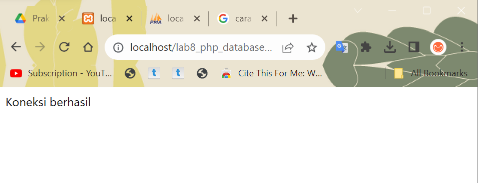
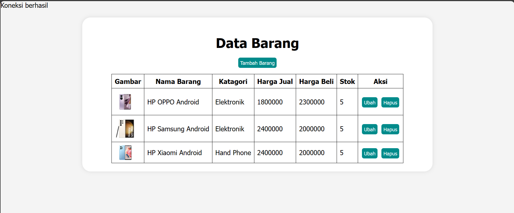
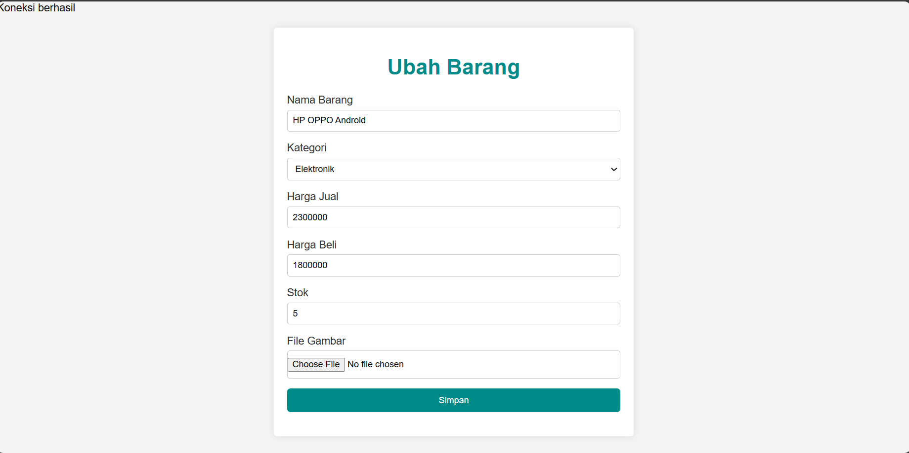

# **Lab 8 PHP Database**

```
Nama    : Abid Luay Raihan Taufik
NIM     : 312210401
Kelas   : TI.22.A.4
Matkul  : Pemrograman Web 1
```

## **Daftar Isi**

**[Instruksi Praktikum](#instruksi-praktikum)**  
**[Langkah-langkah Praktikum](#langkah-langkah-praktikum)**  
**[Result](#result)**

## **Instruksi Praktikum**

1. Persiapkan text editor misalnya VSCode.
2. Buat folder baru dengan nama **lab8_php_database** pada docroot webserver
   (htdocs)
3. Ikuti langkah-langkah praktikum yang akan dijelaskan berikutnya.

## **Langkah-langkah Praktikum**

1. **Persiapan**
   Untuk memulai membuat aplikasi CRUD sederhana, yang perlu disiapkan adalah
   database server menggunakan MySQL. Pastikan MySQL Server sudah dapat dijalankan
   melalui XAMPP.

2. **Menjalankan MySQL Server**
   Untuk menjalankan MySQL Server dari menu XAMPP Control.

3. **Membuat Database: Studi Kasus Data Barang**

   ```mysql
   CREATE DATABASE latihan1;
   ```

   ```mysql
   CREATE TABLE data_barang (
       id_barang int(10) auto_increment Primary Key,
       kategori varchar(30),
       nama varchar(30),
       gambar varchar(100),
       harga_beli decimal(10,0),
       harga_jual decimal(10,0),
       stok int(4)
   );
   ```

4. **Menambah Data**

   ```mysql
   INSERT INTO data_barang (kategori, nama, gambar, harga_beli, harga_jual, stok)
   VALUES ('Elektronik', 'HP Samsung Android', 'hp_samsung.jpg', 2000000, 2400000, 5),
   ('Elektronik', 'HP Xiaomi Android', 'hp_xiaomi.jpg', 1000000, 1400000, 5),
   ('Elektronik', 'HP OPPO Android', 'hp_oppo.jpg', 1800000, 2300000, 5);

   ```

   

5. **Membuat Program CRUD 7Buat folder lab8_php_database pada root directory web server (d:\xampp\htdocs)**

6. **Membuat file koneksi database**
   Buat file baru dengan nama **koneksi.php**

   ```php
   <?php
   $host = "localhost";
   $user = "root";
   $pass = "";
   $db = "latihan1";
   $conn = mysqli_connect($host, $user, $pass, $db);
   if ($conn == false)
   {
       echo "Koneksi ke server gagal.";
       die();
   } #else echo "Koneksi berhasil";
   ?>
   ```

   Buka melalui browser untuk menguji koneksi database untuk menyampilkan pesan
   koneksi berhasil, uncomment pada perintah echo “koneksi berhasil”;
   

7. **Membuat file index untuk menampilkan data (Read)**
   Buat file baru dengan nama **index.php**

   **Akses file -->**[index.php](index.php)

   

8. **Menambah Data (Create)**
   Buat file baru dengan nama **tambah.php**

   **Akses file -->**[tambah.php](tambah.php)

   

9. **Mengubah Data (Update)**
   Buat file baru dengan nama **ubah.php**

   **Akses file -->**[ubah.php](ubah.php)

   

10. **Menghapus Data (Delete)**
    Buat file baru dengan nama **hapus.php**

    ```php
    <?php
    include_once 'koneksi.php';
    $id = $_GET['id'];
    $sql = "DELETE FROM data_barang WHERE id_barang = '{$id}'";
    $result = mysqli_query($conn, $sql);
    header('location: index.php');
    >

    ```

    **Akses file-->**[hapus.php](hapus.php)

**[Back-->](#lab-8-php-database)**
